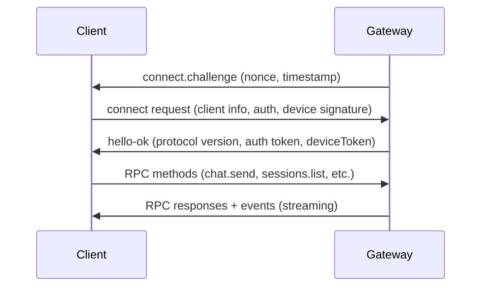

# OpenClaw 控制面板开发方案

## 概述

本文档分析了 OpenClaw 的调用原理，并提出了融合 openhanako 前端样式和独立 Session 功能的控制面板开发方案。

## 一、OpenClaw 调用原理分析

### 1.1 核心通信架构

**WebSocket 网关协议：**

- **传输层：**  WebSocket + JSON-RPC 2.0
- **认证机制：**  JWT Token + 设备签名
- **协议版本：**  当前 v3（minProtocol/maxProtocol 协商）

**连接流程：**



### 1.2 角色与权限系统

**角色类型：**

- ​`operator` - 控制平面（CLI/UI/自动化）
- ​`node` - 能力主机（相机/屏幕/执行等）

**权限范围：**

- ​`operator.read` - 读权限
- ​`operator.write` - 写权限
- ​`operator.admin` - 管理权限
- ​`operator.approvals` - 审批权限

### 1.3 ACP (Agent Client Protocol) 桥接

**工作原理：**

- ​`openclaw acp` 通过 stdio 暴露 ACP 接口
- 内部通过 WebSocket 与 Gateway 通信
- 维护 ACP session ↔ Gateway session 映射关系

**关键特性：**

- 会话隔离：每个 ACP session 映射到独立 Gateway session
- 会话持久化：Gateway 负责 session 状态存储
- 事件转发：Gateway events → ACP notifications

## 二、ClawPanel 架构分析

### 2.1 技术栈

**后端：**

- Go 1.22+ + Gin 框架
- SQLite 数据库
- WebSocket 实时通信
- 单二进制文件部署

**前端：**

- React 18 + TypeScript
- TailwindCSS 样式
- Vite 构建工具
- Lucide 图标库

### 2.2 核心接口

**系统管理：**

- ​`/api/system/status` - 系统整体状态
- ​`/api/system/config` - OpenClaw 配置管理
- ​`/api/system/update` - 版本更新

**Agent 管理：**

- ​`/api/agents` - Agent 列表、创建、更新、删除
- ​`/api/agents/{id}/files` - 工作区文件管理
- ​`/api/agents/{id}/bindings` - 路由规则管理

**通道管理：**

- ​`/api/channels` - 通道配置
- ​`/api/channels/{id}/toggle` - 启用/禁用通道

**技能管理：**

- ​`/api/skills` - 已安装技能列表
- ​`/api/skills/clawhub/search` - ClawHub 技能搜索
- ​`/api/skills/install` - 技能安装

## 三、融合 openhanako 前端样式的可行性

### 3.1 技术栈对比

|项目|openhanako|ClawPanel|兼容性|
| ----------| -----------------------| -----------------| -----------|
|前端框架|React 19 + Vite 7|React 18 + Vite|✅ 高|
|UI 库|未明确|TailwindCSS|✅ 可复用|
|构建工具|Vite 7|Vite|✅ 高|
|语言|JavaScript/TypeScript|TypeScript|✅ 高|

### 3.2 样式融合策略

**方案A：渐进式融合（推荐）**

```typescript
// 1. 提取 openhanako 核心样式变量
// styles/hanako-variables.css
:root {
  --hanako-primary: #4A90E2;
  --hanako-secondary: #50E3C2;
  --hanako-accent: #F5A623;
  --hanako-bg-primary: #1A1A2E;
  --hanako-bg-secondary: #16213E;
}

// 2. 在 ClawPanel 中应用
// App.tsx
import './styles/hanako-variables.css';
import './styles/tailwind.css';
```

**方案B：组件级复用**

- 分析 openhanako 的组件结构
- 提取可复用的 UI 组件（按钮、卡片、模态框等）
- 适配到 ClawPanel 的组件体系

**方案C：主题系统**

- 开发动态主题切换功能
- 支持 openhanako 主题和 ClawPanel 主题
- 用户可自定义主题

## 四、独立 Session 功能设计与实现

### 4.1 需求分析

**目标：**  不依赖频道，直接针对 Agent 创建独立上下文 session

**使用场景：**

- 直接与特定 Agent 对话
- 独立的工作流执行环境
- 调试和测试专用 session
- 多项目并行处理

### 4.2 架构设计

**Session 管理器：**

```typescript
interface IndependentSession {
  sessionId: string;
  agentId: string;
  context: {
    workspace: string;
    variables: Map<string, any>;
    metadata: Record<string, any>;
  };
  status: 'active' | 'paused' | 'closed';
  createdAt: Date;
  lastActivity: Date;
}

class SessionManager {
  // 创建独立 session
  async createSession(agentId: string, options?: {
    workspace?: string;
    variables?: Record<string, any>;
    metadata?: Record<string, any>;
  }): Promise<IndependentSession>;
  
  // 获取 session 列表
  async listSessions(agentId?: string): Promise<IndependentSession[]>;
  
  // 删除 session
  async deleteSession(sessionId: string): Promise<void>;
  
  // 发送消息到 session
  async sendMessage(sessionId: string, message: string): Promise<Stream>;
  
  // 重置 session 上下文
  async resetSession(sessionId: string): Promise<void>;
}
```

### 4.3 实现方案

**基于现有 Gateway 的扩展：**

**方案A：专用 Session 路由**

```
# Session 标识格式
independent:{agentId}:{sessionId}

# 示例
independent:main:debug-session-001
independent:work:project-alpha
```

**API 设计：**

```typescript
// 创建独立 session
POST /api/v1/agents/{agentId}/sessions
{
  "sessionId": "debug-001",
  "variables": {
    "project": "openclaw-control-panel",
    "debug": true
  },
  "metadata": {
    "purpose": "development",
    "creator": "wingdr"
  }
}

// 发送消息
POST /api/v1/sessions/{sessionId}/messages
{
  "content": "帮我分析一下这个代码",
  "attachments": []
}

// 获取 session 详情
GET /api/v1/sessions/{sessionId}
```

### 4.4 前端界面设计

**Session 管理面板：**

```
+-----------------------------------+
| 独立 Session 管理器              |
+-----------------------------------+
| Agent: [main ▼]  [新建 Session]   |
|                                   |
| ┌─────────────────────────────────┐
| │ Session 列表                   │
| │ ┌─────┬──────────┬────────┐   │
| │ │ ID  │ 创建时间  │ 状态   │   │
| │ ├─────┼──────────┼────────┤   │
| │ │dbug1│2026-03-21│ 活跃   │   │
| │ │proj2│2026-03-20│ 暂停   │   │
| │ └─────┴──────────┴────────┘   │
| └─────────────────────────────────┘
|                                   |
| [Session 详情] [发送消息] [删除]  |
+-----------------------------------+
```

## 五、整合开发路线图

### 阶段1：核心集成（2-3周）

- [ ] 分析 openhanako 前端样式结构
- [ ] 搭建基础开发环境
- [ ] 实现 WebSocket 网关连接
- [ ] 开发基础 session 管理

### 阶段2：样式融合（2周）

- [ ] 提取 openhanako 样式变量
- [ ] 设计主题切换系统
- [ ] 重构 UI 组件
- [ ] 实现响应式布局

### 阶段3：独立 Session（3-4周）

- [ ] 设计 Session 管理 API
- [ ] 实现后端 Session 管理
- [ ] 开发前端 Session 界面
- [ ] 集成消息发送和接收

### 阶段4：功能完善（2周）

- [ ] 添加上下文变量管理
- [ ] 实现 Session 持久化
- [ ] 开发调试工具
- [ ] 性能优化

### 阶段5：测试部署（1-2周）

- [ ] 单元测试和集成测试
- [ ] 用户验收测试
- [ ] 文档编写
- [ ] 生产环境部署

## 六、技术挑战与解决方案

### 挑战1：样式兼容性

**解决方案：**  采用 CSS 变量 + 组件级适配策略

### 挑战2：Session 隔离

**解决方案：**  利用 Gateway 现有机制，扩展独立 session 路由

### 挑战3：性能优化

**解决方案：**  虚拟滚动 + 懒加载 + WebSocket 消息批处理

## 七、参考资源

1. [ClawPanel GitHub](https://github.com/zhaoxinyi02/ClawPanel)
2. [OpenClaw 网关协议](https://docs.openclaw.ai/gateway/protocol)
3. [OpenClaw ACP 文档](https://github.com/openclaw/openclaw/blob/main/docs.acp.md)
4. [openhanako 项目](https://github.com/liliMozi/openhanako)

---

**创建时间：**  2026-03-21  
**最后更新：**  2026-03-21  
**版本：**  v1.0
