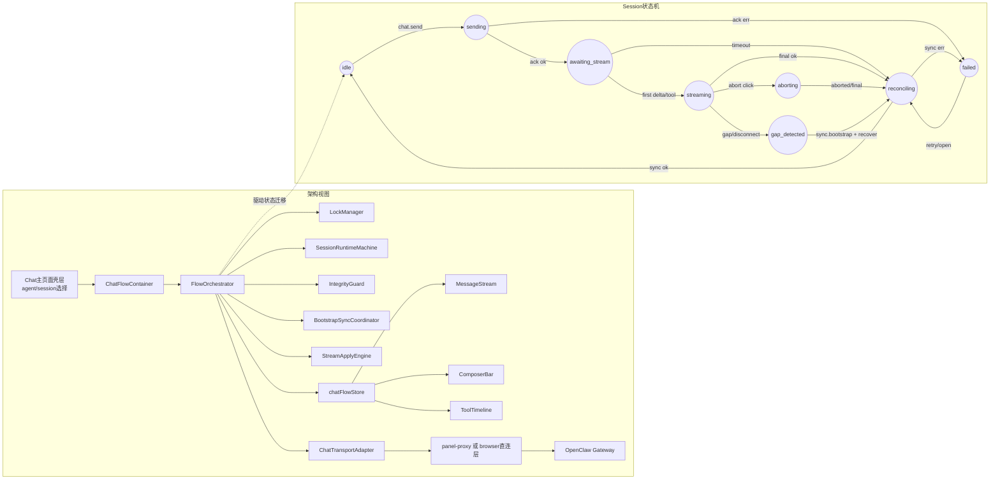

# Chat 流处理模块架构

更新日期 2026-03-24

这份文档是对 chat 处理链路的专项拆分设计，目标是把：

- chat 页面中栏（session 内容渲染）
- chat 信息流处理（连接、同步、推流、完整性校验、锁）

从主页面中抽成一个可独立演进的模块，再嵌入到主页面壳层中，通过“点击选择 session”进行触发。

## 一句话结论

建议引入单独的 `ChatFlowModule`：

- 主页面只负责导航、agent/session 选择、布局壳层
- `ChatFlowModule` 负责中栏渲染与 chat 流处理全链路
- 连接层统一执行“连接周期预同步（首次连接/每次重连）-> 持续推流 -> 完整性失败重同步”
- `session.open` 保持订阅语义，不再承担“前端主动抓 history”
- 并发模型固定为“单 session 单 active run”

## 1. 模块边界与职责

### 1.1 主页面保留职责

- `Chat / Manage` 路由与页面壳层
- agent 列表与 session 列表展示
- session 选择事件分发（把 `selectedSessionKey` 传给模块）
- 全局通知、全局错误提示、布局交互

### 1.2 `ChatFlowModule` 独占职责

- 中栏消息流渲染（history + live + tool + composer）
- chat.send / chat.abort 指令编排
- session.open 订阅编排
- WS 连接生命周期管理
- 连接周期预同步与推流接续
- 事件完整性检查（seq/watermark/cursor）
- send/sync/catalog-refresh 锁管理
- session runtime 状态机推进

## 2. 目标模块结构

建议在前端拆出独立目录：

`panel-web/src/chat-flow/`

- `host/ChatFlowContainer.tsx`
  - 接收主页面输入，渲染 chat 中栏
- `ui/MessageStream.tsx`
- `ui/ComposerBar.tsx`
- `ui/ToolTimeline.tsx`
- `state/chatFlowStore.ts`
  - 仅存放 chat-flow 域状态
- `domain/FlowOrchestrator.ts`
  - 核心编排入口
- `domain/SessionRuntimeMachine.ts`
  - session 状态机
- `domain/LockManager.ts`
  - send/sync/refresh 锁
- `domain/IntegrityGuard.ts`
  - seq/watermark/cursor 连续性检查
- `sync/BootstrapSyncCoordinator.ts`
  - 连接周期预同步
- `stream/StreamApplyEngine.ts`
  - 推流事件应用与去重
- `transport/ChatTransportAdapter.ts`
  - 统一抽象 proxy/web 两种 transport

## 3. 总体架构与状态机（Mermaid）



## 4. 连接与同步协议

### 4.1 连接周期预同步（强制）

触发时机：

- 首次 WS 建连前
- 每次 WS 重连后

执行内容：

1. 同步 agent 列表快照
2. 同步 session 列表快照
3. 同步当前活跃 session 的详情快照（transcript + lastSeq + watermark）
4. 以同步结果覆盖本地基线
5. 再恢复推流订阅

规则：

- 未完成预同步前，禁止提交终态写入
- 预同步后再放行流式事件应用

### 4.2 推流主路径（常态）

常态流程：

- `session.open` 只声明订阅
- 模块持续接收 chat/tool/session 事件
- 通过 `seq/watermark` 连续性校验后写入 runtime
- run 终态默认由推流闭环收束，不主动拉 history

### 4.3 重同步路径（补偿）

仅在下面情况触发：

- seq 不连续
- watermark 回退或不匹配
- reconnect 后基线不可信
- run 长时间卡在 `awaiting_stream/streaming`

触发后动作：

- 标记 `gap_detected`
- 进入 `reconciling`
- 执行 session 级快照重抓
- 重建 watermark 后继续推流

## 5. 锁模型（模块内统一管理）

### 5.1 `sendLock(sessionKey)`

- 作用：保证单 session 单 active run
- 持有：`chat.send` 发起至 run 收束完成
- 冲突：锁存在时拒绝第二次 send

### 5.2 `syncLock(sessionKey)`

- 作用：串行化预同步、重同步与流应用切换
- 规则：同 session 只允许一个同步事务在执行
- 效果：避免“快照写入”和“推流写入”互相覆盖

### 5.3 `catalogRefreshLock(scope=global|agent)`

- 作用：合并 agent/session 目录刷新触发
- 触发源：`sessions.changed`、切换 agent、重连恢复
- 规则：coalescing 合并，不重复并行请求

## 6. Host 与模块接口契约

### 6.1 Host -> Module

```ts
type ChatFlowInput = {
  selectedAgentId: string
  selectedSessionKey?: string
  clientId: string
  transportMode: "proxy" | "direct"
}
```

### 6.2 Module -> Host

```ts
type ChatFlowOutput = {
  onSessionRuntimeChanged?: (sessionKey: string, phase: string) => void
  onSessionPreviewChanged?: (sessionKey: string, preview: string, updatedAt: string) => void
  onFlowError?: (error: { code: string; message: string }) => void
}
```

### 6.3 `session.open` 与 `sync.bootstrap` 返回

```ts
type SessionOpenResult = {
  accepted: boolean
  sessionKey: string
  subscribed: boolean
  fromWatermark?: string
}

type SyncBootstrapResult = {
  at: string
  agents: Array<unknown>
  sessions: Array<unknown>
  sessionSnapshots: Array<{
    sessionKey: string
    transcript: Array<unknown>
    lastSeq?: number
    watermark?: string
  }>
}
```

## 7. 页面集成方式

### 7.1 触发链路

1. 用户在主页面点击某个 session
2. 主页面更新 `selectedSessionKey`
3. `ChatFlowContainer` 接到变更，调用 `session.open`（订阅语义）
4. 模块按当前连接状态执行：
   - 已有可信基线：直接接推流
   - 基线缺失或过期：进入同步批次后接推流
5. 中栏只渲染模块输出状态，不直接操作 WS

### 7.2 迁移原则

- 先把中栏 UI 移入 `chat-flow/ui`
- 再迁移事件处理与状态机
- 最后移除 `ChatPage.tsx` 中与流处理强耦合的逻辑

## 8. 验收清单

- 主页面能在不感知内部流细节的前提下嵌入 `ChatFlowModule`
- 点击 session 后不再由页面主动抓 chat history
- 首次连接与每次重连都会执行预同步
- 正常路径只靠推流收束 run
- gap 或断流时自动重同步并恢复推流
- 同 session 双击发送不会出现两个 active run
- 渠道 session 与普通 session 走同一套处理逻辑

## 参考

- [12 Chat Session 状态同步与锁设计复盘 2026-03-24](./12%20Chat%20Session%20%E7%8A%B6%E6%80%81%E5%90%8C%E6%AD%A5%E4%B8%8E%E9%94%81%E8%AE%BE%E8%AE%A1%E5%A4%8D%E7%9B%98%202026-03-24.md)
- [10 Gateway WS 客户端数据流草案 2026-03-22](./10%20Gateway%20WS%20%E5%AE%A2%E6%88%B7%E7%AB%AF%E6%95%B0%E6%8D%AE%E6%B5%81%E8%8D%89%E6%A1%88%202026-03-22.md)
- [11 Panel Proxy 最小接口协议 v0.1 2026-03-22](./11%20Panel%20Proxy%20%E6%9C%80%E5%B0%8F%E6%8E%A5%E5%8F%A3%E5%8D%8F%E8%AE%AE%20v0.1%202026-03-22.md)
