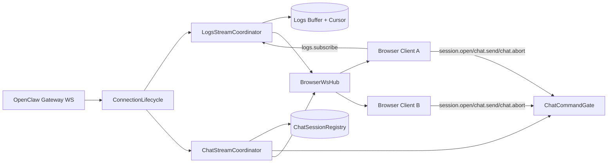

# Proxy Chat 与 Logs 推流同步模块设计

更新日期 2026-03-24

本文是 `panel-proxy` 专项设计，回答一个核心问题：

- chat 推流/同步与 logs 推流/同步，是否“直接透传”就够？
- 如果不够，proxy 最小应加哪些校验与编排？

## 一句话结论

- `logs`：可以采用“轻校验透传”，不需要重型状态机。
- `chat`：不建议直接透传，必须采用“增强透传”，至少要有 run/session 归属校验、订阅范围控制、完整性检测和重同步入口。

换句话说：  
`logs` 以 cursor 连续性为主；`chat` 以语义一致性为主。

## 1. 当前实现复盘（proxy）

### 1.1 logs 现状

当前 `logsService.ts` 已经具备：

- `logs.tail` 轮询拉取
- `cursor` 跟踪
- `reset` 检测与 `logs.reset` 广播
- 订阅管理与内存缓冲

这说明 logs 已经不是“裸透传”，而是“有状态适配”。

### 1.2 chat 现状

当前 chat 相关能力分散在：

- `gatewayClient.ts`
  - Gateway event 归一化后 `browserWsHub.broadcast`
- `index.ts`
  - `chat.send/chat.abort/session.open` 命令处理

问题是：

- chat 事件现在基本是“归一化后全量广播”
- `session.open` 只 ack，不管理订阅范围
- 没有 per-session/per-run 的完整性校验与去重
- 没有 proxy 侧 run registry / send lock 约束

这对 chat 一致性是偏弱的。

## 2. 直接透传 vs 增强透传：决策矩阵

| 流类型 | 直接透传 | 建议 | 原因 |
|---|---|---|---|
| Logs | 可行但不推荐裸透传 | 轻校验透传 | logs 只需要顺序与游标连续性，语义复杂度低 |
| Chat | 不建议 | 增强透传 | chat 有 run/session/tool 语义，乱序/丢帧/晚到会直接影响 UI 与状态机 |

结论：

- logs：保留当前“cursor + reset”模型，并做轻量补强。
- chat：需要独立模块，不要继续挂在 `gatewayClient` 的广播分支里。

## 3. Proxy 模块拆分建议

建议新增目录：

`panel-proxy/src/streaming/`

- `shared/ConnectionLifecycle.ts`
  - Gateway 连接事件、重连阶段、连接代次（epoch）
- `logs/LogsStreamCoordinator.ts`
  - logs.tail 拉取、cursor 连续性、reset、广播
- `chat/ChatStreamCoordinator.ts`
  - chat/tool/session 事件路由、归属校验、去重、重同步入口
- `chat/ChatSessionRegistry.ts`
  - session 订阅关系、active run、lastSeq/watermark
- `chat/ChatCommandGate.ts`
  - send/abort/session.open 的锁与参数守门

## 4. Logs 方案：轻校验透传

## 4.1 保留直通特性

- 不做 logs 内容级语义解析（除基础格式化）
- 不做复杂状态机

## 4.2 必加校验

- `cursor` 连续性校验
- `reset` 原因明确化（`cursor-invalid` / `file-rotated` / `reconnected`）
- `append` 包含 `cursor` 与 `batchId`
- 可选：代理端追加 `proxySeq`，便于前端 debug 重放

## 4.3 推荐事件 envelope

```ts
type ProxyLogsEnvelope = {
  type: "event"
  event: "logs.append" | "logs.reset"
  topic: "logs:gateway"
  at: string
  proxySeq: number
  payload: {
    cursor: number
    lines?: Array<{ ts: string; level: string; text: string }>
    reason?: string
    batchId?: string
  }
}
```

## 5. Chat 方案：增强透传（必须）

## 5.1 为什么不能直接透传

chat 事件存在这些结构性风险：

- run 归属错误（晚到事件挂到新 run）
- session 归属错误（topic 解析不稳或缺字段）
- 工具流与最终消息顺序不稳定
- 断线后流恢复缺少边界

只做归一化广播不够，需要 proxy 参与最小一致性保障。

## 5.2 必加能力

### A. 订阅范围控制

- `session.open` 不只 ack，要登记“该 ws 订阅哪些 session”
- chat/tool/session 事件按订阅关系转发，而不是全量广播给所有 ws

### B. 会话运行态注册表

`ChatSessionRegistry` 至少维护：

```ts
type SessionRuntimeEntry = {
  sessionKey: string
  activeRunId?: string
  phase: "idle" | "awaiting_stream" | "streaming" | "aborting" | "reconciling"
  lastSeq?: number
  watermark?: string
  lastEventAt?: string
}
```

### C. 完整性校验

- 若上游有 `seq`：做连续性校验
- 若上游无 `seq`：proxy 生成 per-session `proxySeq`
- 校验失败时发 `chat.sync.required`

### D. 命令守门（锁）

- `chat.send`：同 session 存在 active run 时拒绝或排队（首版建议拒绝）
- `chat.abort`：仅在 active run 存在时允许
- `session.open`：订阅登记幂等化

### E. 连接周期重同步入口

- 首次连接与每次重连后，可触发 `sync.bootstrap`
- 返回 sessions 快照与已活跃 session 基线（history + watermark）

## 5.3 推荐事件 envelope

```ts
type ProxyChatEnvelope = {
  type: "event"
  event: "chat.delta" | "chat.lifecycle" | "tool.lifecycle" | "chat.sync.required"
  kind: "chat" | "tool" | "sync"
  topic?: string
  at: string
  sessionKey: string
  runId?: string
  seq?: number
  watermark?: string
  proxySeq: number
  payload: Record<string, unknown>
}
```

## 6. Proxy 总体架构（Mermaid）



## 7. 实施优先级

### Phase 1（先拆模块，不改对外协议）

- 从 `gatewayClient.ts` 抽出 `ChatStreamCoordinator`
- 从 `logsService.ts` 抽出 `LogsStreamCoordinator`
- 增加 `ChatSessionRegistry`（先只做订阅范围 + active run）

### Phase 2（加校验与补偿）

- chat 加 `proxySeq` / `seq` 连续性检查
- 增加 `chat.sync.required` 事件
- `session.open` 改为实际订阅登记

### Phase 3（加连接周期重同步）

- 新增 `sync.bootstrap` handler
- 重连后基线恢复再接推流
- 与前端 `ChatFlowModule` 对齐

## 8. 最终决策（可执行）

- Logs：继续保留透传导向，但增加 `proxySeq + cursor/reset` 级校验，不引入复杂语义状态机。
- Chat：必须独立模块并增强透传，至少落地：
  - 订阅范围控制
  - active run 守门
  - per-session 连续性校验
  - 重同步触发事件

如果只做“归一化 + broadcast”，后续前端状态机再完善也会被 proxy 层数据质量拖住。

## 参考

- `panel-proxy/src/logsService.ts`
- `panel-proxy/src/gatewayClient.ts`
- `panel-proxy/src/index.ts`
- [13 Chat 流处理模块架构 2026-03-24](./13%20Chat%20%E6%B5%81%E5%A4%84%E7%90%86%E6%A8%A1%E5%9D%97%E6%9E%B6%E6%9E%84%202026-03-24.md)
- [12 Chat Session 状态同步与锁设计复盘 2026-03-24](./12%20Chat%20Session%20%E7%8A%B6%E6%80%81%E5%90%8C%E6%AD%A5%E4%B8%8E%E9%94%81%E8%AE%BE%E8%AE%A1%E5%A4%8D%E7%9B%98%202026-03-24.md)
